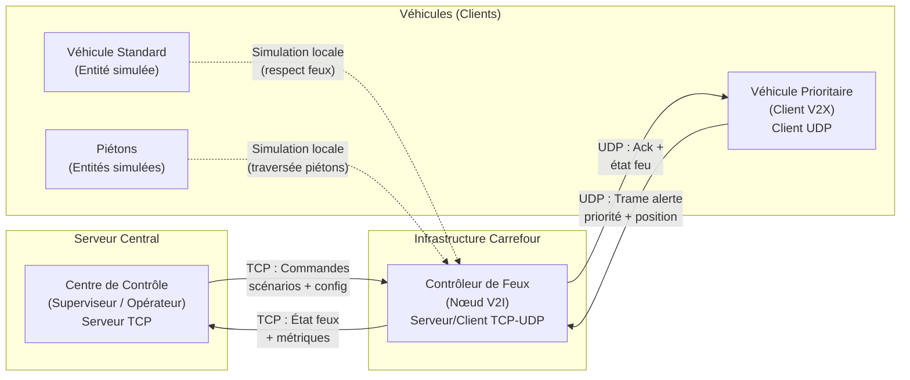
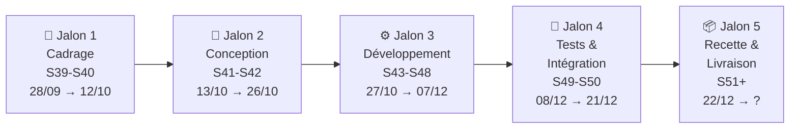

# Cahier des Charges — Projet Esk-2718

## SAÉ 3.02 — Développer une application communicante
### Simulation 2D de régulation intelligente de carrefours pour véhicules prioritaires

| Information | Détail |
|---|---|
| **Nom du projet** | Esk-2718 |
| **Nom du groupe** | Esk-2718 |
| **Auteur** | Golde Julian |
| **Formation** | BUT Réseaux & Télécommunications — Semestre 3 |
| **Établissement** | IUT de Colmar — Université de Haute-Alsace |
| **Date** | 30 septembre 2026 |
| **Version** | 1.0 — Draft initial |

> **Origine du nom** : *Esk* est la lettre **E** dans l'alphabet
> **Aurebesh** de l'univers Star Wars. *2718* correspond aux premiers
> chiffres significatifs du nombre d'Euler (*e* ≈ 2,71828…).

---

## Table des matières

1. [Présentation du projet](#1-présentation-du-projet)
2. [Spécifications techniques](#2-spécifications-techniques)
3. [Périmètre fonctionnel & Coût humain](#3-périmètre-fonctionnel--coût-humain)
4. [Planning et livrables](#4-planning-et-livrables)
- [Annexe A — Analyse QQOQCP](#annexe-a--analyse-qqoqcp)
- [Annexe B — Périmètre IN / OUT (WBS)](#annexe-b--périmètre-in--out-wbs)
- [Annexe C — Matrice RACI](#annexe-c--matrice-raci)
- [Annexe D — Glossaire](#annexe-d--glossaire)
- [Annexe E — Note sur l'utilisation de l'IA](#annexe-e--note-sur-lutilisation-de-lia)

---

## 1. Présentation du projet

### 1.1 Le contexte

Le client est la **direction des mobilités** d'une collectivité
territoriale, responsable de la circulation urbaine et de la gestion
des carrefours à feux. Sa mission : garantir la fluidité du trafic
et la sécurité des usagers de la route dans un environnement urbain dense.

Dans le cadre de la modernisation de ses systèmes de régulation
(VTA — Véhicule Toutes Alertes / VTI — Véhicule Tout Intérieur), la
collectivité souhaite explorer les technologies de communication
V2X (Vehicle-to-Everything) et V2I (Vehicle-to-Infrastructure) pour
optimiser le passage des véhicules de secours aux intersections.

Un **cabinet de conseil en technologies de l'information** (incarné par
l'équipe étudiante Esk-2718) est mandaté pour réaliser cette pré-étude
logicielle dans le cadre d'un marché public.

### 1.2 La problématique

Les véhicules de secours (pompiers, SAMU, police) rencontrent des
**difficultés critiques de passage aux carrefours à feux** en milieu
urbain :

- **Perte de temps aux intersections** : les feux rouges imposent des
  arrêts ou des franchissements dangereux en situation d'urgence.
- **Risques de collision** : le franchissement d'un feu rouge dans un
  trafic dense expose les véhicules prioritaires et les autres usagers
  à un risque d'accident élevé.
- **Absence de coordination** : les éléments du carrefour (feux,
  capteurs, véhicules) ne communiquent pas entre eux.
- **Coût des tests terrain** : tester des solutions de régulation
  directement sur l'infrastructure réelle est coûteux et risqué.

**Besoin du client** : disposer d'une **maquette logicielle de simulation**
permettant de pré-tester des scénarios de régulation intelligente avant
tout investissement matériel lourd.

### 1.3 La solution proposée

Développement d'une **application communicante de simulation 2D** modélisant
un carrefour urbain avec :

- **Affichage graphique 2D** d'un carrefour (voies, feux tricolores,
  passages piétons, véhicules, piétons) ;
- **Simulation paramétrable** : l'opérateur peut charger des scénarios
  variés (densité de trafic, flux piétons, survenue d'urgences) ;
- **Communication réseau V2X/V2I** en temps réel entre les véhicules en
  approche et l'infrastructure de carrefour via des sockets TCP/UDP ;
- **Régulation intelligente** : modification dynamique des feux pour
  libérer la voie au profit des véhicules prioritaires ;
- **Collecte de métriques** (temps de passage, accidents, comportement
  piétons) et **visualisation statistique** (tableaux de bord, graphiques) ;
- **Conduite parfaite imposée** : tous les véhicules non-prioritaires
  respectent systématiquement et intégralement le code de la route.

L'application sert de **preuve de concept** pour valider l'approche avant
de passer à des tests physiques à échelle supérieure.

---

## 2. Spécifications techniques

### 2.1 Langage de base

| Élément | Choix |
|---|---|
| **Langage** | Python 3.x (contrainte imposée) |
| **Version retenue** | Python 3.12+ |

### 2.2 Architecture technique et organisationnelle

L'application suit une **architecture client-serveur distribuée** simulant
les communications V2X / V2I :

| Composant | Rôle | Protocole |
|---|---|---|
| **Centre de Contrôle** (Serveur) | Supervision, chargement scénarios, tableau de bord | TCP (fiable) |
| **Contrôleur de Feux** (Serveur/Client) | Gestion des feux, réception alertes V2X, régulation | TCP + UDP |
| **Véhicule Prioritaire** (Client) | Émission de l'alerte de priorité, réception de l'état des feux | UDP (temps réel) |
| **Véhicules Standards / Piétons** | Entités simulées localement, respect strict du code de la route | Simulation interne |

**Choix des protocoles** :
- **TCP** pour les échanges fiables (configuration, métriques, commandes) ;
- **UDP** pour les échanges temps réel entre véhicules et carrefour
  (faible latence, tolérance à la perte).

### 2.3 Frameworks et librairies

#### Interface Graphique (IHM) — Obligatoire

| Librairie | Usage |
|---|---|
| `PyQt6` (ou `PySide6`) | Framework GUI principal |
| `PyQt6.QtWidgets` | Composants d'interface (fenêtres, boutons, menus) |
| `PyQt6.QtCore` | Signaux/Slots, QThread, timers |
| `PyQt6.QtGui` | Graphismes, polices, couleurs |
| `QGraphicsScene` / `QGraphicsView` | Affichage 2D du carrefour (recommandé) |

> ❌ **Interdits** : Tkinter, CustomTkinter, Pygame, Kivy, wxPython

#### Communications Réseau (V2X / V2I) — Obligatoire

| Librairie | Usage |
|---|---|
| `socket` | Sockets TCP / UDP |
| `select` | I/O multiplexée (gestion de plusieurs connexions) |
| `struct` ou `json` | Sérialisation / désérialisation des trames |

> ❌ **Interdits** : Twisted, Scapy, MQTT (paho-mqtt), tout framework haut niveau.
> La couche transport/session doit être codée manuellement sur des sockets brutes.

#### Concurrence & Multi-threading — Obligatoire

| Librairie | Usage |
|---|---|
| `QThread` + `pyqtSignal` / `Signal` | Threads intégrés à l'IHM Qt (recommandé) |
| `threading` (Thread, Lock, Event) | Boucles réseau / calcul en arrière-plan |

> ⚠️ **Règle d'or (Thread-Safety)** : Il est **strictement interdit** de
> modifier directement les composants de l'IHM depuis un `threading.Thread`.
> Toute mise à jour graphique **DOIT** passer par le mécanisme de
> Signals / Slots de Qt.

#### Base de données & Utilitaires — Autorisés

| Librairie | Usage |
|---|---|
| `sqlite3` | Stockage local des métriques, statistiques, historiques |
| `math`, `random`, `time`, `datetime` | Calculs de simulation |
|  `pyqtgraph` | Graphiques statistiques intégrés à l'IHM |

### 2.4 Environnement de développement

| Élément | Choix |
|---|---|
| **IDE** | Visual Studio Code (avec extensions Python + Pylance) |
| **Environnement virtuel** | `venv` (module standard Python) |
| **Gestion des dépendances** | Versions exactes du requirements.txt créé (PyQt6==6.11.0, pyqtgraph==0.14.0, numpy==2.2.6) |
| **Gestionnaire de version** | Git / GitHub (dépôt public) |

> ⚠️ **Critère éliminatoire** : Toute librairie absente du `requirements.txt`
> ou hors de la liste autorisée entraînera un **refus en recette anonyme**.

### 2.5 Contraintes techniques annexes

| Contrainte | Choix / Détail |
|---|---|
| **Base de données** | `sqlite3` — fichier local, zéro configuration serveur |
| **Versionnement** | Git + GitHub (dépôt public, commits réguliers) |
| **Compatibilité OS** | Windows (développement principal), Linux (compatible via Python + Qt) |
| **Encodage** | UTF-8 systématique |
| **Documentation du code** | Docstrings normalisées + commentaires sur chaque fonction/classe |

---

## 3. Périmètre fonctionnel & Coût humain

### 3.1 Tableau des fonctionnalités

| ID | Fonctionnalité | Priorité (MoSCoW) | Complexité (1-5) | Coût humain estimé (h) |
|---|---|---|---|---|
| **EF-01** | **Affichage 2D du carrefour** — Vue graphique avec voies, feux tricolores, passages piétons via `QGraphicsScene` / `QGraphicsView` | **Must have** | 4 | 20h |
| **EF-02** | **Simulation de véhicules standards** — Circulation en respectant intégralement le code de la route (conduite parfaite) | **Must have** | 3 | 5h |
| **EF-03** | **Véhicules prioritaires** — Véhicules de secours identifiables visuellement, avec comportement de priorité | **Must have** | 3 | 5h |
| **EF-04** | **Régulation dynamique des feux** — Changement automatique des feux au profit du véhicule prioritaire en approche (V2I) | **Must have** | 4 | 5h |
| **EF-05** | **Communication réseau (sockets)** — Échange de trames entre entités (véhicule → carrefour → centre de contrôle) via TCP/UDP | **Must have** | 5 | 10h |
| **EF-06** | **Chargement de scénarios** — L'opérateur peut charger et paramétrer des scénarios (densité trafic, piétons, urgences) | **Must have** | 3 | 15h |
| **EF-07** | **Gestion robuste des erreurs** — Gestion des exceptions réseau, IHM, simulation. Aucun crash non géré. | **Must have** | 3 | 5h |
| **EF-08** | **Comportement piétons** — Piétons aux passages protégés avec densité paramétrable | **Should have** | 3 | 12h |
| **EF-09** | **Collecte de métriques en BDD** — Enregistrement sqlite3 : temps de passage, délais, incidents | **Must have** | 3 | 10h |
| **EF-10** | **Visualisation statistique** — Graphiques intégrés (matplotlib/pyqtgraph) : histogrammes, courbes de performance | **Should have** | 3 | 15h |
| **EF-11** | **Tableau de bord opérateur** — Vue synthétique des KPIs en temps réel pendant la simulation | **Should have** | 4 | 15h |
| **EF-12** | **Historique des simulations** — Consultation et comparaison des résultats passés depuis la BDD | **Could have** | 2 | 6h |
| **EF-13** | **Export des résultats** — Export CSV/PDF des métriques et graphiques | **Could have** | 2 | 5h |
| **EF-14** | **Multi-carrefour en cascade** — Gestion de plusieurs carrefours interconnectés | **Won't have (V2)** | 5 | 30h+ |
| | | | **Total estimé** | **≈ 128h** |

### 3.2 Exigences non-fonctionnelles

| ID | Catégorie | Exigence |
|---|---|---|
| **ENF-01** | Robustesse | Aucun crash non géré ; messages d'erreur explicites |
| **ENF-02** | Thread-Safety | Zéro modification directe de l'IHM depuis un worker thread |
| **ENF-03** | Performance | Animation 2D fluide (≥ 30 FPS) |
| **ENF-04** | Ergonomie | Interface intuitive, utilisable sans formation |
| **ENF-05** | Maintenabilité | Code modulaire, docstrings, commentaires |
| **ENF-06** | Portabilité | Compatible Windows / Linux |
| **ENF-07** | Reproductibilité | `requirements.txt` strict avec versions exactes |
| **ENF-08** | Conformité | Code de la route respecté par tous les véhicules non-prioritaires |

---

## 4. Planning et livrables

### 4.1 Dates limites (Deadlines)

| Livrable | Deadline | Statut |
|---|---|---|
| QQOQCP + Bilan présentation | Dimanche 05/10/2026 | 🔄 En cours |
| Cahier des Charges (v1) | Dimanche 05/10/2026 | 🔄 En cours |
| CR hebdomadaire #1 | Dimanche 05/10/2026 | 🔄 En cours |
| CR hebdomadaires suivants | Chaque dimanche | ⏳ Récurrent |
| Rendu final (dépôt GitHub) | _Date à confirmer_ | ⏳ À planifier |
| Bilan_Projet.pdf | _Date à confirmer_ | ⏳ À planifier |
| IAGraphie.pdf | _Date à confirmer_ | ⏳ À planifier |
| Recette croisée anonyme | _Date à confirmer_ | ⏳ À planifier |

### 4.2 Rétroplanning (Timeline)

| Phase | Semaines | Jalons / Livrables | Détail |
|---|---|---|---|
| **1. Cadrage** | S39-S40 | QQOQCP, CdC v1, CR#1 | Analyse du besoin, rédaction des documents de cadrage |
| **2. Conception** | S41-S42 | Architecture détaillée, maquettes IHM, protocole réseau | Conception des modules, diagrammes, prototypes d'écrans |
| **3. Développement** | S43-S48 | Code source (IHM, réseau, simulation, BDD), CR hebdomadaires | Développement itératif des modules fonctionnels |
| **4. Tests & Intégration** | S49-S50 | Tests complets, correction bugs, documentation technique | Tests unitaires, intégration, robustesse, rédaction docs |
| **5. Recette & Livraison** | S51+ | Dépôt GitHub final, Bilan_Projet.pdf, IAGraphie.pdf, recette croisée | Livraison, tests pairs, portfolio compétences |

> ⚠️ _Planning indicatif — les dates exactes du rendu final et de la recette
> seront ajustées dès communication par l'enseignant._

### 4.3 Livrables attendus (récapitulatif complet)

| # | Livrable | Format | Emplacement | Fréquence |
|---|---|---|---|---|
| 1 | QQOQCP + Bilan présentation | Markdown / PDF | Racine GitHub | Unique |
| 2 | Cahier des Charges | Markdown / PDF | Racine GitHub | Unique + MAJ |
| 3 | CR hebdomadaire (relevé de décisions) | Markdown / PDF | Dossier dédié | Hebdomadaire |
| 4 | Code source Python (.py) | Scripts organisés | Dépôt GitHub | Continu |
| 5 | `requirements.txt` | Fichier texte | Racine GitHub | MAJ continue |
| 6 | `README.md` | Markdown | Racine GitHub | Livraison finale |
| 7 | Documentation technique | Markdown | Dépôt GitHub | Livraison finale |
| 8 | Guide utilisateur | Markdown / PDF | Dépôt GitHub | Livraison finale |
| 9 | `Bilan_Projet.pdf` | PDF | Racine GitHub | Livraison finale |
| 10 | `IAGraphie.pdf` | PDF | Racine GitHub | Livraison finale |
| 11 | Portfolio de compétences (AC/CE) | Document argumenté | Moodle | Livraison finale |

---

## Annexe A — Analyse QQOQCP

### Quoi ? (Objet)
Maquette logicielle de simulation 2D de carrefours urbains avec régulation
dynamique des feux de circulation au profit des véhicules prioritaires.

### Qui ? (Acteurs)
- **Client** : Collectivité territoriale (direction des mobilités)
- **Prestataire** : Cabinet de conseil IT (équipe Esk-2718)
- **Développeur** : Golde Julian
- **Évaluateurs** : Enseignants + pairs (recette anonyme)
- **Utilisateurs finaux** : Opérateurs PC Circulation, conducteurs de secours

### Où ? (Environnement)
Déploiement local. Architecture réseau distribuée via sockets simulant les
échanges V2X/V2I. Versionnement sur GitHub.

### Quand ? (Temporalité)
Premier livrable : dimanche 05/10/2026. Phases suivantes : voir section 4.

### Comment ? (Moyens)
Python 3.x avec stack technique imposée (voir section 2).

### Pourquoi ? (Finalité)
- Minimiser le temps de parcours des véhicules prioritaires
- Objectif zéro accident aux carrefours
- Pré-étude économique avant investissement matériel (modernisation VTA/VTI)

---

## Annexe B — Périmètre IN / OUT (WBS)

### IN Scope ✅

| ID | Élément |
|---|---|
| IN-01 | Simulation 2D d'un carrefour avec feux tricolores |
| IN-02 | Véhicules standards et prioritaires animés |
| IN-03 | Piétons avec comportement paramétrable |
| IN-04 | Communication réseau V2X/V2I via sockets TCP/UDP |
| IN-05 | Régulation dynamique des feux |
| IN-06 | Chargement de scénarios par l'opérateur |
| IN-07 | Collecte et stockage des métriques en BDD |
| IN-08 | Tableaux de bord et graphiques statistiques |
| IN-09 | Gestion robuste des erreurs et exceptions |
| IN-10 | Documentation complète (technique + utilisateur) |

### OUT of Scope ❌

| ID | Élément | Justification |
|---|---|---|
| OUT-01 | Simulation 3D | Périmètre 2D uniquement |
| OUT-02 | Connexion à de vrais capteurs/feux | Simulation logicielle uniquement |
| OUT-03 | Déploiement cloud | Exécution locale imposée |
| OUT-04 | IA / Machine Learning | Algorithmes déterministes |
| OUT-05 | Application mobile | Desktop Python uniquement |
| OUT-06 | Multi-carrefour en cascade | Won't have — envisageable en V2 |

---

## Annexe C — Matrice RACI

| Livrable / Tâche | Golde Julian | Enseignant | Pairs |
|---|---|---|---|
| Cahier des charges | **R/A** | C | I |
| Développement (IHM, réseau, simulation, BDD) | **R/A** | — | — |
| Tests | **R/A** | — | — |
| Documentation | **R/A** | C | I |
| CR hebdomadaires | **R/A** | I | — |
| Dépôt GitHub final | **R/A** | I | I |
| Bilan_Projet.pdf | **R/A** | C | — |
| Recette croisée (test d'un autre groupe) | **R/A** | I | **R** |
| Portfolio compétences | **R/A** | C | — |

---

## Annexe D — Glossaire

| Terme | Définition |
|---|---|
| **V2X** | Vehicle-to-Everything — Communication véhicule ↔ tout élément environnant |
| **V2I** | Vehicle-to-Infrastructure — Communication véhicule ↔ infrastructure routière |
| **VTA** | Véhicule Toutes Alertes — Véhicule prioritaire avec droit de passage |
| **VTI** | Véhicule Tout Intérieur — Véhicule prioritaire d'intervention |
| **IHM** | Interface Homme-Machine |
| **MoSCoW** | Must / Should / Could / Won't — Méthode de priorisation |
| **WBS** | Work Breakdown Structure — Décomposition du travail |
| **RACI** | Responsible / Accountable / Consulted / Informed |
| **PC Circulation** | Poste de Commandement de la circulation urbaine |
| **Socket** | Point de terminaison de communication réseau bidirectionnelle |
| **Thread-Safety** | Garantie de fonctionnement correct en contexte multi-thread |
| **Signal/Slot** | Mécanisme de communication inter-objets Qt |
| **Aurebesh** | Alphabet fictif de l'univers Star Wars |

---

## Annexe E — Note sur l'utilisation de l'IA

La structuration et la mise en forme de ce cahier des charges ont été
réalisées avec l'assistance d'un modèle de langage (LLM). L'ensemble
des choix de périmètre, contraintes techniques, exigences fonctionnelles
et estimations de coût humain a été établi, vérifié et validé sous la
seule responsabilité de l'auteur, conformément aux notes de cadrage du
projet et aux consignes de l'enseignant.
